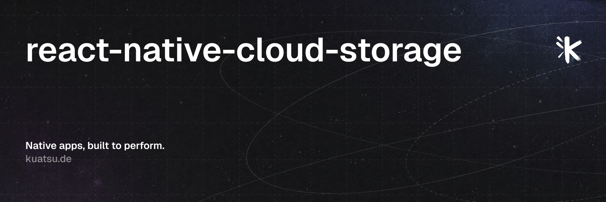

<a href="https://kuatsu.de/?utm_campaign=generic&utm_source=github&utm_medium=referral&utm_content=react-native-cloud-storage" align="center">
  <picture>
    
  </picture>
</a>

# react-native-cloud-storage

[](https://www.npmjs.com/package/react-native-cloud-storage)
[](https://github.com/kuatsu/react-native-cloud-storage/actions/workflows/ci.yml)
[](LICENSE)

**The React Native cloud drive layer.**

React Native Cloud Storage gives your app a unified and developer-friendly API for accessing cloud storage services on iOS, Android and Web. It supports document storage and key-value stores across iCloud (on iOS only) and Google Drive (all platforms).

- 💾 Read and write files to the cloud
- 🔑 Store key-value pairs on the cloud
- 🧪 Fully compatible with Expo
- 📱 iOS & Android support, plus Web support for text-based Google Drive operations
- 🏎️ Lightning fast iCloud performance using native iOS APIs
- 🌐 Google Drive REST API implementation for all platforms
- 🧬 Easy to use React Hooks API, or use the imperative `fs`-style API
- 👌 Zero dependencies, small bundle size

## Documentation

The documentation is available at [cloudstorage.kuatsu.de](https://cloudstorage.kuatsu.de).

## Installation

Install the package using your favorite package manager.

```sh
npm install react-native-cloud-storage
# or
yarn add react-native-cloud-storage
```

If you're using Expo, [add the provided config plugin](https://cloudstorage.kuatsu.de/docs/installation/expo) and `expo prebuild` or rebuild your development client.

## Quick Start

```jsx
import React from 'react';
import { Platform, View, Text, Button } from 'react-native';
import { CloudStorage, CloudStorageProvider, useIsCloudAvailable } from 'react-native-cloud-storage';

const App = () => {
  const cloudAvailable = useIsCloudAvailable();

  React.useEffect(() => {
    if (CloudStorage.getProvider() === CloudStorageProvider.GoogleDrive) {
      // get access token via @react-native-google-signin/google-signin or similar
      CloudStorage.setProviderOptions({ accessToken: 'some-access-token' });
    }
  }, []);

  const writeToCloud = async () => {
    await CloudStorage.writeFile('/file.txt', 'Hello, world!');
    console.log('Successfully wrote file to cloud');
  };

  const readFromCloud = async () => {
    const value = await CloudStorage.readFile('/file.txt');
    console.log('Successfully read file from cloud:', value);
  };

  return (
    <View>
      {cloudAvailable ? (
        <>
          <Button onPress={writeToCloud} title="Write to Cloud" />
          <Button onPress={readFromCloud} title="Read from Cloud" />
        </>
      ) : (
        <Text>The cloud storage is not available. Are you logged in?</Text>
      )}
    </View>
  );
};
```

## Contributing

See the [contributing guide](CONTRIBUTING.md) to learn how to contribute to the repository and the development workflow.

## Built at Kuatsu

Kuatsu is a boutique React Native agency specialized on building highly performant React Native apps. Visit [https://kuatsu.de](kuatsu.de) to learn more about our work.
